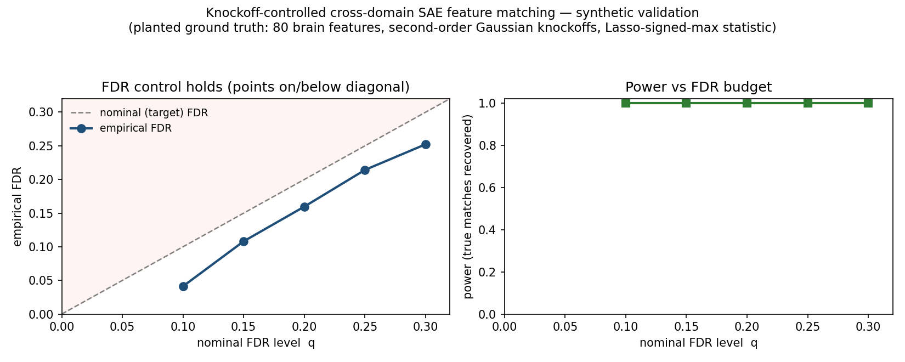
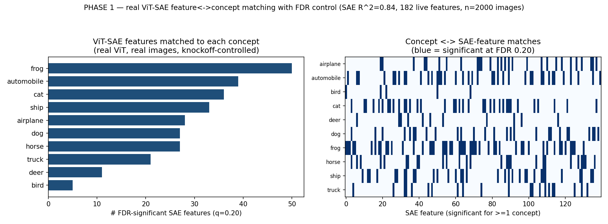
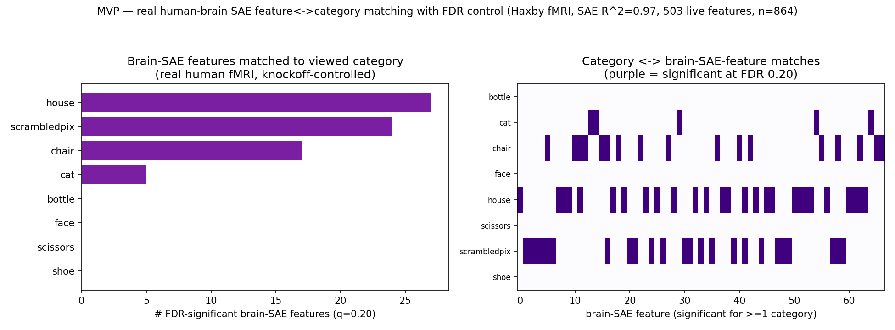

# cross-sae

**Reliable cross-domain SAE feature matching: vision models ↔ human visual cortex.**

Which interpretable features does an artificial vision model genuinely *share*
with the human brain — with a calibrated error rate, not a cherry-picked example?

This repo trains sparse autoencoders (SAEs) on **both** a vision transformer and
human brain responses to the **same** images, then matches features across the two
domains under **false-discovery-rate (FDR) control** (Model-X knockoffs) and a
**seed-stability filter**. It is, to our knowledge, the first cross-domain
(model↔brain) SAE feature matching with statistical error control.

See [`research_plan.md`](research_plan.md) for the full motivation, the
adversarially-verified prior-work gap analysis, the honesty boundary on the
statistics, and the milestone plan.

## Quickstart (runs in ~10s, no GPU, no downloads)

```bash
pip install numpy scipy scikit-learn matplotlib torch
python experiments/demo_fdr_matching.py
```

Produces `results/fdr_calibration.png` — a validation on synthetic data with
**planted ground-truth matches** showing the matching procedure controls FDR
(empirical ≤ nominal across q ∈ [0.10, 0.30]) while recovering the true matches.
This is the day-zero go/no-go check before touching real brain data.



## Layout

```
crosssae/
  knockoffs.py   Gaussian Model-X knockoffs + Lasso-signed-max + knockoff+ threshold
  sae.py         Top-k sparse autoencoder (trained identically on model & brain)
  stability.py   seed-stability core (PW-MCC) — defends against SAE non-determinism
  synthetic.py   planted-ground-truth generator for falsifiable validation
  data.py        real loaders: ViT activations (timm) + THINGS-EEG2 (HuggingFace)
experiments/
  demo_fdr_matching.py   end-to-end synthetic validation -> results/
research_plan.md   the full research plan
```

## Scaling to real data

```bash
pip install datasets timm pillow
```

Then `crosssae/data.py` exposes `load_vit_activations(...)` (model side) and
`load_things_eeg2(...)` (brain side), both keyed to the shared THINGS image set so
features can be matched per-stimulus.

## Honesty note

Model-X knockoffs give *exact* FDR control only when the covariate distribution is
known. On real SAE latents we use estimated Gaussian knockoffs, so control is
**approximate/asymptotic** — validating it empirically on brain latents is part of
the work, not an assumption. See §4 of the research plan.

## Phase 1 — real model-side pipeline (runs end to end)

```bash
pip install timm torchvision
python experiments/phase1_vit_sae.py
```

Runs the full pipeline on a **real pretrained ViT** over **real images**
(CIFAR-10), trains a real Top-k SAE (R²≈0.84), and matches its features to
semantic concepts under **FDR control** — the model-side analog of the brain
experiment. Swapping the concept indicators for brain-side SAE features is the
only change needed for the headline cross-domain run.



Result: across 10 concepts, 277 FDR-controlled feature↔concept matches (q=0.2),
with clearly structured concept selectivity (see `results/phase1_concept_features.csv`).

## MVP — real human-brain-side pipeline (runs end to end)

```bash
pip install nilearn
python experiments/mvp_brain_sae.py
```

The brain half of the method, on **real human fMRI** (Haxby 2001, ventral-temporal
cortex, 8 object categories): real fMRI → **brain-side** Top-k SAE (R²≈0.97) →
FDR-controlled matching of brain features to the viewed category. Unsupervised
brain-SAE features recover known ventral-temporal organization (strong, cleanly
separated **scene/house** selectivity) under knockoff FDR control — 73 matches
across the categories that clear threshold.



Together with Phase 1, **both domains now run on real data through the identical
knockoff engine** (model-SAE↔concept and brain-SAE↔concept). The only remaining
step for the headline model↔brain result is to join them on a shared-stimulus set
(THINGS), where the right-hand matrix becomes the *other domain's* SAE features.

## Status

- ✅ Statistical engine (knockoff FDR matching) validated on synthetic
  ground-truth (`results/fdr_calibration.png`).
- ✅ Phase 1 (model side): real ViT → real SAE → FDR feature↔concept matching
  (`results/phase1_vit_sae.png`).
- ✅ MVP (brain side): real human fMRI → brain SAE → FDR feature↔category matching
  (`results/mvp_brain_sae.png`).
- ⏭️ Next: join both on shared stimuli (THINGS) for the model↔brain result;
  add the seed-stability gate to the real runs.
