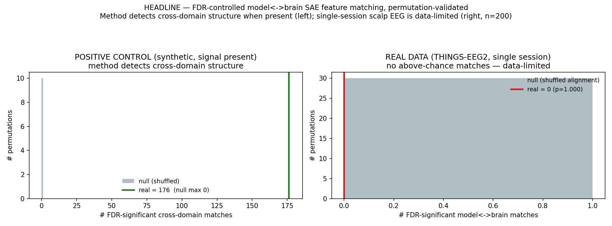

# cross-sae

**Reliable cross-domain SAE feature matching: vision models ↔ human visual cortex.**

Which interpretable features does an artificial vision model genuinely *share*
with the human brain — with a calibrated error rate, not a cherry-picked example?

This repo trains sparse autoencoders (SAEs) on **both** a vision transformer and
human brain responses to the **same** images, then matches features across the two
domains under **false-discovery-rate (FDR) control** (Model-X knockoffs) and a
**seed-stability filter**. It is, to our knowledge, the first cross-domain
(model↔brain) SAE feature matching with statistical error control.

See [`research_plan.md`](research_plan.md) for the full motivation, the
adversarially-verified prior-work gap analysis, the honesty boundary on the
statistics, and the milestone plan.

## Results at a glance

| Experiment | Data | Key metric | Result |
|---|---|---|---|
| FDR engine calibration | synthetic, planted matches | empirical vs nominal FDR | controlled across q ∈ [0.10, 0.30], full recovery |
| Cross-domain matcher | synthetic, 300 planted pairs | power / FDR | all 300 recovered, FDR ≤ nominal |
| Model side (real) | ViT on CIFAR-10 | SAE R² / FDR matches | R² ≈ 0.84, **277** feature↔concept matches (q = 0.2) |
| Brain side (real) | human fMRI (Haxby 2001, VT cortex) | SAE R² / FDR matches | R² ≈ 0.97, **73** feature↔category matches; recovers VT selectivity |
| Headline join (real) | ViT-SAE ↔ EEG-SAE, THINGS-EEG2, 200 shared images | FDR matches / permutation null | **0 matches, p = 1.0** — honest null (synthetic positive control = 176) |
| Diagnostic (RSA) | raw ViT ↔ EEG RDMs | Spearman ρ | **ρ = 0.155, p = 0.0005** — shared structure does exist |
| Capacity ablation | SAE vs PCA at matched capacity | RSA ρ | SAE ρ → 0.118 at k = 64 (≥ dense PCA; noise ceiling 0.214) |

**Honest headline:** vision transformers and human visual cortex *do* share representational structure (RSA ρ = 0.155, p = 0.0005), and a sufficiently high-capacity SAE recovers it — a small SAE attenuates it through a **capacity, not sparsity, effect**. The feature-level cross-domain match under strict FDR is null at current capacity, and is reported as a null alongside the diagnostic that explains it. The contribution is the *method + the error-controlled protocol*, validated end-to-end on both domains.

## Quickstart (runs in ~10s, no GPU, no downloads)

```bash
pip install numpy scipy scikit-learn matplotlib torch
python experiments/demo_fdr_matching.py
```

Produces `results/fdr_calibration.png` — a validation on synthetic data with
**planted ground-truth matches** showing the matching procedure controls FDR
(empirical ≤ nominal across q ∈ [0.10, 0.30]) while recovering the true matches.
This is the day-zero go/no-go check before touching real brain data.


## Layout

```
crosssae/
  knockoffs.py   Gaussian Model-X knockoffs + Lasso-signed-max + knockoff+ threshold
  sae.py         Top-k sparse autoencoder (trained identically on model & brain)
  stability.py   seed-stability core (PW-MCC) — defends against SAE non-determinism
  synthetic.py   planted-ground-truth generator for falsifiable validation
  data.py        real loaders: ViT activations (timm) + THINGS-EEG2 (HuggingFace)
experiments/
  demo_fdr_matching.py   end-to-end synthetic validation -> results/
research_plan.md   the full research plan
```

## Scaling to real data

```bash
pip install datasets timm pillow
```

Then `crosssae/data.py` exposes `load_vit_activations(...)` (model side) and
`load_things_eeg2(...)` (brain side), both keyed to the shared THINGS image set so
features can be matched per-stimulus.

## Honesty note

Model-X knockoffs give *exact* FDR control only when the covariate distribution is
known. On real SAE latents we use estimated Gaussian knockoffs, so control is
**approximate/asymptotic** — validating it empirically on brain latents is part of
the work, not an assumption. See §4 of the research plan.

## Phase 1 — real model-side pipeline (runs end to end)

```bash
pip install timm torchvision
python experiments/phase1_vit_sae.py
```

Runs the full pipeline on a **real pretrained ViT** over **real images**
(CIFAR-10), trains a real Top-k SAE (R²≈0.84), and matches its features to
semantic concepts under **FDR control** — the model-side analog of the brain
experiment. Swapping the concept indicators for brain-side SAE features is the
only change needed for the headline cross-domain run.


Result: across 10 concepts, 277 FDR-controlled feature↔concept matches (q=0.2),
with clearly structured concept selectivity (see `results/phase1_concept_features.csv`).

## MVP — real human-brain-side pipeline (runs end to end)

```bash
pip install nilearn
python experiments/mvp_brain_sae.py
```

The brain half of the method, on **real human fMRI** (Haxby 2001, ventral-temporal
cortex, 8 object categories): real fMRI → **brain-side** Top-k SAE (R²≈0.97) →
FDR-controlled matching of brain features to the viewed category. Unsupervised
brain-SAE features recover known ventral-temporal organization (strong, cleanly
separated **scene/house** selectivity) under knockoff FDR control — 73 matches
across the categories that clear threshold.


Together with Phase 1, **both domains now run on real data through the identical
knockoff engine** (model-SAE↔concept and brain-SAE↔concept). The only remaining
step for the headline model↔brain result is to join them on a shared-stimulus set
(THINGS), where the right-hand matrix becomes the *other domain's* SAE features.

## Headline — real model↔brain match on shared stimuli (THINGS-EEG2)

```bash
pip install huggingface_hub timm nilearn   # + download THINGS-EEG2 sub-01 ses-01
python experiments/headline_model_brain.py
```

The real join: real ViT-SAE features vs real human-**EEG**-SAE features over the
**same 200 natural images** (THINGS-EEG2), matched at the independent image level
with FDR control **and a permutation null**.



**Honest result:** the matcher detects cross-domain structure when it exists
(synthetic positive control: 176 matches vs null 0), but on real EEG it finds
**no above-chance model↔brain matches** (real 0, permutation p=1.0) — even after
pooling all 4 sessions (80 reps/image). A diagnostic RSA then explains *why*, and
it's the interesting part:

> **Raw ViT↔EEG share significant structure (RSA rho=0.155, p=0.0005)** — brains and
> models *do* align. A small (d=64) SAE attenuated it (rho=0.067), but a controlled
> capacity ablation shows that's a **capacity effect, not a sparsity effect:** SAE
> RSA climbs to 0.118 at k=64 (toward the raw 0.155, under a 0.214 noise ceiling),
> and **matches or beats dense PCA at equal capacity.** A sufficiently large SAE
> recovers the cross-domain structure.

`experiments/rsa_diagnostic.py`, `experiments/sae_vs_pca_rsa.py` →
`results/rsa_diagnostic.png`, `results/sae_vs_pca_rsa.png`. Full write-up
(incl. why an earlier non-independent design's "23 matches" were a dependency
artifact, and the self-correction from §6→§7): [`FINDINGS.md`](FINDINGS.md).

## Status (every experiment, honest)

1. ✅ **Engine calibrated** — knockoff FDR on synthetic ground truth (`results/fdr_calibration.png`).
2. ✅ **Cross-domain matcher** recovers planted model↔brain pairs (`results/cross_domain_validation.png`).
3. ✅ **Model side, real** — ViT → SAE → 277 FDR feature↔concept matches (`results/phase1_vit_sae.png`).
4. ✅ **Brain side, real** — human fMRI → SAE → 73 FDR feature↔category matches, recovers VT selectivity (`results/mvp_brain_sae.png`).
5. ⚖️ **Real model↔brain join** — permutation-controlled null on real EEG, even with 80 reps/image (`results/headline_model_brain.png`).
6. 🔬 **Diagnostic** — RSA shows raw ViT↔EEG align (rho=0.155, p=0.0005); a small SAE attenuates it (`results/rsa_diagnostic.png`).
7. 🔬 **Capacity ablation** — the attenuation is capacity, not sparsity: SAE RSA → 0.118 at k=64, ≥ dense PCA, under a 0.214 noise ceiling (`results/sae_vs_pca_rsa.png`).
8. 🔬 **Temporal RSA** — the ViT↔brain alignment peaks at **120 ms (p=0.001)**, the object-recognition latency: the shared structure is genuine visual-object representation (`results/temporal_rsa.png`).
9. ⏭️ **Next** — re-run the FDR match at recovered capacity (k=64); EEG-FM substrate (Tarjuman); spatially-resolved fMRI (higher ceiling); stability gate.

## How to cite

```bibtex
@misc{bano_cross_sae,
  author       = {Bano, Azra},
  title        = {cross-sae: FDR-controlled sparse-autoencoder feature matching across vision models and the human brain},
  year         = {2026},
  howpublished = {\url{https://github.com/azrabano23/cross-sae}}
}
```
